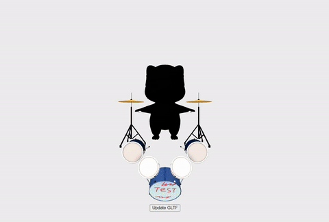

# A-Frame-Component-GLTF-Manipulator



### **Description / Rationale**
This is a A-Frame component which allows to manipulate GLTF/GLB file. In particular it support editing position, rotation, scale, visibility, material color and texture of individual nodes.  

### **Instructions**

In order to use the component one attach "gltf-manipulator" to an entity. The component has the following attributes: 
* nodeNumber: { type: 'int', default: 1 } - the number of nodes of a GLTF/GLB file to be edited. All other attributes are dependent on it, i.e. if 2 is indicated, then the rest of attributes should have by 2 values.   
* nodeName: { type: 'array', default: [] } - the name of individual node(s) in a GLTF/GLB file. It is different from node material name. Accepts array of strings.  
* nodePosition: { type: 'array', default: [] } - position of individual node(s) in a GLTF/GLB file. Accepts array of x y z values.
* nodeRotation: { type: 'array', default: [] } - rotation of individual node(s) in a GLTF/GLB file. Accepts array of x y z values.
* nodeScale: { type: 'array', default: [] } - scale of individual node(s) in a GLTF/GLB file. Accepts array of x y z values.
* nodeVisibility: { type: 'array', default: [] } - visibility of individual node(s) in a GLTF/GLB file. Accepts array of boolean values
* nodeMaterialName: { type: 'array', default: [] } - the name(s) of individual node material(s) in a GLTF/GLB file. It is different from node name. Accepts array of strings.
* nodeTextureURL: { type: 'array', default: [] } - the URL(s) of individual node(s) in a GLTF/GLB file. Accepts array of strings.
* nodeColor: { type: 'array', default: [] } - color(s) of individual node(s). Accepts array of HEX values.

Sample code for running the component is provided below:
```
<html>
<head>
    <title>A-Frame Component: GLTF Manipulator</title>
    <script src="https://aframe.io/releases/1.4.2/aframe.min.js"></script>
    <script src="https://cdn.jsdelivr.net/gh/donmccurdy/aframe-extras@v6.1.1/dist/aframe-extras.min.js"></script>
    <script src="js/gltf-manipulator-component.js"></script>
</head>

<body>
    <a-scene>
        <a-entity gltf-manipulator="
        nodeNumber: 2;
        nodeName: Circle003_drum_paint_0, Cube004_drum_defaultCol_0; 
        nodePosition: 0 0 0, 0 0 0;
        nodeRotation: 90 0 0, 0 0 0;
        nodeScale: 1 1 1, 1 1 1;
        nodeVisibility: true, true;
        nodeMaterialName: drum_paint, raccoon_paint; 
        nodeTextureURL: ;
        nodeColor: " 
        id="model" 
        position="0 1 -3" 
        scale="0.2 0.2 0.2" 
        gltf-model="url(model/raccoon.glb)"
        animation-mixer>
        </a-entity>
        <a-sky color="#ECECEC"></a-sky>
    </a-scene>
    <script>
        // Update individual nodes
        document.querySelector('a-scene').addEventListener('loaded', function () {
            document.querySelector('#myButton').addEventListener('click', () => {
                
                // Update dynamically the node 
                updateNodeFunction(
                    'drum_paint',       // node name
                    'model/drum.png',   // textureURL
                    '0 -4 1',            // position
                    '0 0 0',            // rotation
                    '1 1 1',            // scale
                    '#ffffff',          // color
                    true                // visibility
                );
                updateNodeFunction(
                    'raccoon_paint',       // node name
                    'model/raccoon.png',   // textureURL
                    '0 1 1',            // position
                    '0 0 0',            // rotation
                    '1 1 1',            // scale
                    '#ffffff',          // color
                    true                // visibility
                );
            
            });
        })

    </script>
</body>

</html>
```
After entering camera mode (inside AR), direct your camera at the location you created your map and tap once on the screen. This will trigger localization of the point cloud and you should see the point cloud and/or GLTF model you loaded. Please note the counter for successful localizations at the top of the screen.  

### **Tech Stack**
The project is powered by AFrame and Three.js. 

### **Limitations**
It works on Android Chrome, and you should have the chrome://flags/#webxr-incubations set to 'enabled' if Chrome ver. is below 113. The latest chrome browsers have webxr incubations by default. iOS devices, unfortunately, are not supported for now. 
